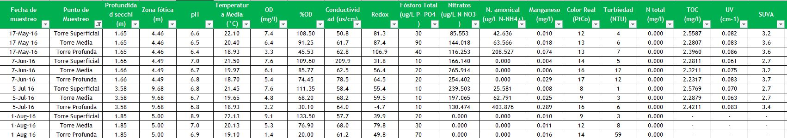
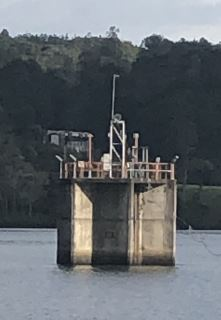
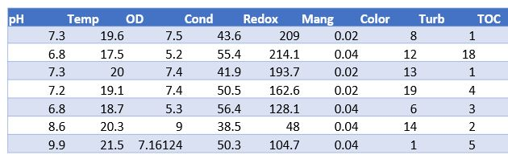
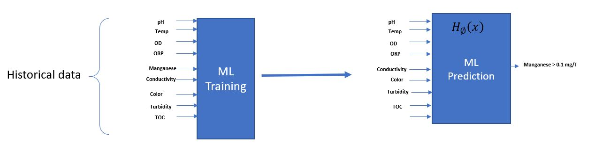

# Problem Definition:

Using historic data from 2012 to 2018 from a La Fe reservoir in Medellin, Colombia, to estimate manganese Alarm levels using Machine learning algorithms using analytical parameters from Source Water Monitors that measure pH, Temperature, Dissolve Oxygen, Conductivity, ORP, Color, Turbidity, TOC, and UV.

Captation Tower data

The data were sampled from three submersion levels at the pump station located at the suction tower that supplies raw water for the "La Ayura Plant."

 

# Hypotesis:
The hypothesis is to use analytical instrumentation from water source monitor (pH, Temp, OD, ORP, Conductivity, Color, and Turbidity) to estimate alarm level of Manganese greater than 0.1 mg/l and 0.05 mg/l

**Data structure for training**

**Machine learning model**

1) Perform an Exploratory Data Analysis on the data
2) Model building - Logistic Regression with  Coefficient interpretations and checking  model performance
3) Evaluate ROC-AUC to find an Optimal threshold using the AUC-ROC curve Training set
4) Evaluate the Precision-Recall curve and compare the performance of Standard Logistic Regression with an optimal Threshold using the ROC-AUC and Precision recall curve.
5) Build a decision tree Model
6) Evaluate the Performance of the decision tree Model
7) Evaluate GridSearch for Hyperparameter tuning of our tree model
8) Evaluate feacture importance based on DTM
9) Perform Cost Complexity Pruning
10) Model performance evaluation and improvement  between Decision Tree sklearn	Decision Tree (Pre-Pruning)	Decision Tree (Post-Pruning) 

