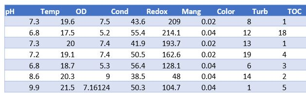
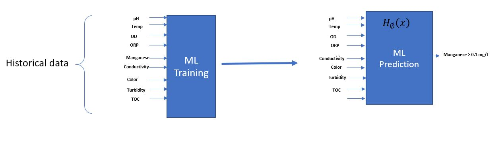

<<<<<<< HEAD
# Dataplayground
Repository for evaluation and proof of concept of ML model on Water and wastewater automation
=======
# Manganese_PC
Proof of concept Manganese Prediction from a water reservoir using source water monitoring sensors
 Problem Definition:

Using historical data from 2012 to 2018 from a La Fe reservoir in Medellin, Colombia, to estimate manganese Alarm levels, machine learning algorithms use analytical parameters from Source Water Monitors that measure pH, Temperature, Dissolved Oxygen, Conductivity, ORP, Color, Turbidity, TOC, and UV. 

Captation Tower data

The data were sampled from three submersion levels at the pump station located at the suction tower that supplies raw water for the "La Ayura Plant."

      

# Hypotesis:
The hypothesis is to use analytical instrumentation from water source monitor (pH, Temp, OD, ORP, Conductivity, Color, and Turbidity) to estimate alarm level of Manganese greater than 0.1 mg/l and 0.05 mg/l

Data structure for training

## Data Overview

The data consists of measurements from various sampling points, including chemical concentrations, water quality indicators, and physical properties of the water like temperature and pH. The analysis aims to ensure data quality and reliability for subsequent environmental assessments.

**Data Analysis:**
**Descriptive Statistics:** The notebook includes code for calculating and handling missing values, which indicates that data cleanliness is a concern.

**Visualization:** There are multiple functions and calls to generate histograms, box plots, and line plots. These visualizations likely serve to explore data distributions and identify outliers or anomalies.

**Data Imputation:** The notebook has sections aimed at handling missing data. It seems to apply different strategies for imputation based on the nature of the data (e.g., using mean or median values depending on the distribution characteristics).

**Outlier Handling:** Some cells focus on identifying and handling outliers, which is crucial for maintaining the integrity of data analyses.

**Final Data Handling:** Towards the end of the notebook, there are operations for resetting the data index and saving the processed data back to a CSV file, suggesting a preparation of data for further analysis or use.

**Additional Functions:** The notebook includes custom functions for plotting, which are reused multiple times to facilitate consistent 
**visualization of various data aspects.**

The data itself, based on variable names like 'OD' (which could stand for Oxygen Demand) and environmental terms, suggests that this notebook is used for analyzing environmental measurements, possibly from a specific location like 'Embalse La Fe' mentioned in the dataset name.

## Data Columns:
**PM:** Sampling point name.

**Profuidad:** Depth at which the sample was taken.

**Zona fótica:** Light penetration depth in the water.

**pH:** Acidity or alkalinity of the water.

**Temperatura:** Water temperature.

**OD (Oxygen Demand):** Amount of oxygen required.

**OD%:** Percentage of oxygen saturation.

**Conductividad:** Electrical conductivity of the water.

**Redox:** Oxidation-reduction potential.

**Fósforo Total:** Total phosphorus levels.

**Nitratos, N. amonical, Mang, etc.:** Various nitrogenous compounds and other chemical measurements.

**Algas, Cianobacterias totales:** Counts of algae and total cyanobacteria.

**Coliformes totales, E.coli:** Indicator organisms for water quality.

**Other chemical concentrations** like F N, CL N, NO2 N, etc.

## Key Insights from Data:

*The data is structured with 560 entries and 35 columns.
*It has several missing values across different columns which are handled in the notebook through imputation strategies.
*The dataset is likely used for environmental monitoring and water quality assessment.
## Task for the Notebook:
Based on the dataset and notebook content:

**Data Cleaning:** Addressing missing values and outliers, which is crucial given the nature of the data.

**Data Visualization:** Using plots to understand distributions and identify trends or anomalies, which is essential for environmental data analysis.
**Data Preparation:** The final steps include preparing the data for further analysis or reporting, such as resetting indices and saving the cleaned data.
>>>>>>> cbe8d64fb4723cca7da4f39b26896a6a1e389bc1
