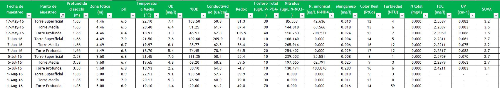
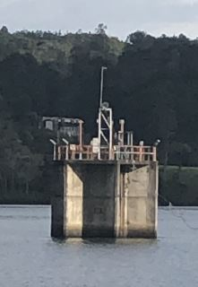
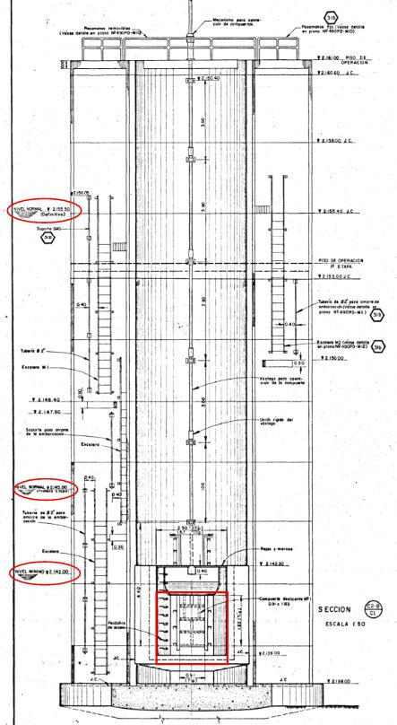

# Manganese_PC
Proof of concept Manganese Prediction from a water reservoir using source water monitoring sensors
 Problem Definition:

Using historical data from 2012 to 2018 from a La Fe reservoir in Medellin, Colombia, to estimate manganese Alarm levels, machine learning algorithms use analytical parameters from Source Water Monitors that measure pH, Temperature, Dissolved Oxygen, Conductivity, ORP, Color, Turbidity, TOC, and UV. 

Captation Tower data

The data were sampled from three submersion levels at the pump station located at the suction tower that supplies raw water for the "La Ayura Plant."

      

